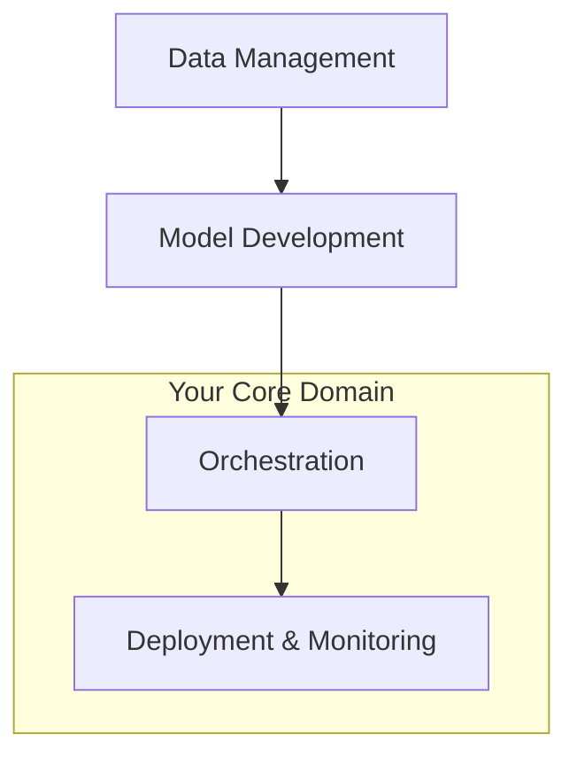

# **MLOps Engineering Mastery Document**
## **Bridging Backend/DevOps Expertise to AI Engineering**

---

## **1. Core Philosophy: Your Strategic Advantage**

### **Why Your Background is a Superpower**
- **The AI Production Gap:** 87% of data science projects never make it to production (Gartner). You solve this.
- **From Research to Revenue:** You don't build models; you build **AI-powered products**.
- **The MLOps Mindset:** "If a model isn't serving predictions, it doesn't exist."

### **Your Value Proposition**
"I transform experimental ML code into reliable, scalable, and monitored production systems. While data scientists focus on model accuracy, I focus on **system reliability, scalability, and maintainability**."

---

## **2. The MLOps Technical Stack & Your Role**

### **The Four Pillars of Production ML**


### **Open-Source Tool Mastery Map**

| Category | Tools | Your Focus | Why It Matters |
|----------|-------|------------|----------------|
| **Experiment Tracking** | MLflow, Weights & Biases | **Model registry, reproducibility** | Track what works, version models, enable rollbacks |
| **Workflow Orchestration** | Prefect, Airflow, Kubeflow | **Pipeline reliability, dependency management** | Automated retraining, data validation, error handling |
| **Model Serving** | FastAPI, BentoML, Seldon Core | **API design, scalability, latency** | Business integration, real-time inference |
| **Monitoring** | Evidently AI, Grafana, Prometheus | **Drift detection, performance metrics** | Model health, data quality, business impact |
| **Feature Store** | Feast, Hopsworks | **Data consistency, real-time features** | Training-serving skew prevention |

---

## **3. Deep Dive: The Selected Projects**

### **PROJECT 1: End-to-End MLOps Pipeline (Model Drift Detection)**

#### **Technical Architecture**
```
Data Source → Prefect Pipeline → MLflow Experiment → Best Model → FastAPI → Evidently Monitoring
```

#### **Your Engineering Focus**
1. **Pipeline Reliability**
   - Implement retry mechanisms for data fetching
   - Set up data validation checks
   - Handle missing data gracefully

2. **Model Management**
   - Use MLflow to track experiment parameters and metrics
   - Implement model versioning and staging (Staging → Production)
   - Automated model promotion based on validation metrics

3. **Drift Detection System**
   - Statistical tests for data distribution changes
   - Performance degradation alerts
   - Automated retraining triggers

#### **Interview Talking Points**
- "I built an automated pipeline that detects when models become stale and triggers retraining, similar to how we'd monitor microservice health"
- "Using MLflow's model registry gives us the same governance and version control we expect for application code"
- "The drift detection acts as our circuit breaker for model quality"

### **PROJECT 2: RAG System with Open-Source Stack**

#### **System Components**
```
Documents → Embedding Pipeline → Chroma DB → FastAPI → LangChain → Monitoring
```

#### **Your Engineering Focus**
1. **Vector Database Management**
   - Chroma DB setup and optimization
   - Embedding pipeline with Prefect
   - Index maintenance and updates

2. **LLM Application Patterns**
   - Prompt versioning and testing
   - Response caching strategies
   - Rate limiting and cost management

3. **Evaluation Framework**
   - Ragas for automated quality scoring
   - User feedback collection
   - A/B testing different retrieval strategies

#### **Interview Talking Points**
- "I treated the RAG system as a distributed application, not just a model - with proper APIs, monitoring, and scalability considerations"
- "By using MLflow to track different embedding models and chunking strategies, we can systematically improve retrieval quality"
- "The challenge isn't the AI - it's building a system that remains reliable as document volumes grow"

### **PROJECT 3: Real-Time Feature Store Implementation**

#### **Architecture Pattern**
```
Batch Sources → Feast → Online Store → Model Serving
Stream Sources → Feature Server
```

#### **Your Engineering Focus**
1. **Feature Engineering Pipeline**
   - Point-in-time correct feature calculation
   - Backfill capabilities for training data
   - Feature validation and monitoring

2. **Real-Time Serving**
   - Low-latency feature retrieval
   - Consistency between batch and streaming features
   - Feature versioning and evolution

3. **Time-Series Model Integration**
   - Windowed feature aggregation
   - Model performance with real-time features
   - Monitoring feature freshness

#### **Interview Talking Points**
- "The feature store solves the training-serving skew problem - the ML equivalent of 'it worked on my machine'"
- "By building real-time feature pipelines, we enable models that can react to immediate changes in user behavior"
- "This is essentially building a high-performance data service specifically optimized for ML workloads"

---

## **4. MLOps Concepts to Master**

### **The ML Lifecycle vs Software Lifecycle**

| Traditional Software | Machine Learning Systems |
|---------------------|--------------------------|
| Code + Configuration | Code + Data + Model |
| Unit Tests | Data Validation + Model Tests |
| Version Control (Git) | Model Registry + Data Versioning |
| CI/CD | CI/CD/CT (Continuous Training) |
| Application Monitoring | Model + Data Drift Monitoring |

### **Key MLOps Patterns**

#### **Pattern 1: Pipeline-Centric Development**
```python
# Instead of: train_model.py
# You build:
@pipeline
def training_pipeline():
    data = validate_data()
    features = engineer_features(data)
    model = train_model(features)
    evaluate_model(model)
    if metrics_met:
        deploy_model(model)
```

#### **Pattern 2: Model as Microservice**
```python
# Your model is a service with:
# - Health checks
# - Metrics endpoint
# - Version management
# - Load balancing
```

#### **Pattern 3: GitOps for ML**
- Infrastructure as Code (Terraform)
- Pipeline as Code (Prefect/Airflow)
- Model Config as Code
- Environment consistency

---

## **5. Interview Strategy & Messaging**

### **Your Core Narrative**
"I'm not a data scientist who learned DevOps. I'm a production engineer who specializes in making AI systems reliable, scalable, and maintainable."

### **Answering Common Questions**

**Q: "Why move from backend to ML engineering?"**
**A:** "I'm drawn to the challenge of productionizing intelligent systems. My backend experience gives me a unique advantage in building ML systems that actually deliver business value, not just experimental accuracy."

**Q: "What's your experience with [ML concept]?"**
**A:** Frame through engineering lens:
- "Model serving? I've built high-availability APIs with proper monitoring and scaling."
- "Feature stores? I've implemented data services optimized for ML feature retrieval."
- "ML pipelines? I've automated the complete lifecycle from data to deployment."

**Q: "How do you work with data scientists?"**
**A:** "I'm the bridge between research and production. I help data scientists by providing them with reliable pipelines, experiment tracking, and a clear path to deployment - so they can focus on model innovation."

### **Questions to Ask Them**
1. "What does your current ML deployment process look like?"
2. "How do you handle model monitoring and retraining in production?"
3. "What's the biggest challenge you face in productionizing ML models?"
4. "How is the ML platform team structured versus data science teams?"

---

## **6. Two-Week Study Plan**

### **Week 1: Foundation & Project Execution**
- **Days 1-2:** MLflow + Prefect deep dive
- **Days 3-4:** Build Project 1 end-to-end
- **Days 5-6:** Document and refine
- **Day 7:** Practice explaining architecture decisions

### **Week 2: Advanced Patterns & Integration**
- **Days 8-9:** Chroma DB + Feast implementation
- **Days 10-11:** Build Projects 2 & 3
- **Day 12:** Integration and monitoring
- **Day 13:** Create interview narratives
- **Day 14:** Mock interviews and refinement

---

## **7. Success Metrics**

### **What "Mastery" Looks Like**
- You can explain **why** each tool is chosen, not just **what** it does
- You can articulate trade-offs (MLflow vs W&B, Prefect vs Airflow)
- You discuss systems, not just models
- You focus on reliability, monitoring, and scalability
- You speak the language of both engineers and data scientists

### **Red Flags to Avoid**
- ❌ "I trained a model with 95% accuracy"
- ✅ "I built a system that maintains 95% accuracy in production through automated monitoring and retraining"

- ❌ "I used TensorFlow/PyTorch"
- ✅ "I containerized TensorFlow models with proper resource management and autoscaling"

---

## **8. Additional Resources**

### **Quick Reference**
- [MLflow Documentation](https://mlflow.org/docs/latest/index.html)
- [Prefect Tutorials](https://docs.prefect.io/latest/tutorials/first-steps/)
- [Feast Quickstart](https://docs.feast.dev/getting-started/quickstart)

### **Concept Deep Dives**
- Google's "MLOps: Continuous delivery and automation pipelines in machine learning"
- "Hidden Technical Debt in Machine Learning Systems" (Google Research Paper)

**Remember:** You're not becoming a data scientist. You're becoming the engineer who makes data science work at scale. Your backend and DevOps experience is your foundation - now you're adding the ML-specific layers on top.

You've got this!


# **MLOps Engineering Mastery: Project Deep Dives**
## **Detailed Technical Implementation Guides**

---

## **PROJECT 1: End-to-End MLOps Pipeline for Model Drift Detection**

### **Architecture Overview**
```
Data Source → Prefect Pipeline → MLflow Tracking → Model Registry → FastAPI Service → Evidently Monitoring
     ↓              ↓               ↓              ↓              ↓              ↓
 S3/PostgreSQL   Validation     Experiment      Versioning    REST API      Drift Detection
                 & Cleaning     Tracking        & Staging                   & Alerts
```

### **Implementation Plan**

#### **Phase 1: Core Pipeline Setup (Days 1-3)**
```python
# 1. Data Pipeline with Prefect
from prefect import flow, task
from sklearn.datasets import load_breast_cancer
from sklearn.model_selection import train_test_split
import pandas as pd

@task
def load_data():
    """Simulate data loading from source"""
    data = load_breast_cancer()
    df = pd.DataFrame(data.data, columns=data.feature_names)
    df['target'] = data.target
    return df

@task
def validate_data(df: pd.DataFrame):
    """Data validation checks"""
    # Check for missing values
    assert not df.isnull().any().any(), "Missing values detected"
    # Check data types
    assert all(df.dtypes != object), "Non-numeric columns found"
    return df

@flow(name="training-pipeline")
def training_flow():
    # Execute pipeline
    raw_data = load_data()
    clean_data = validate_data(raw_data)
    # Continue with training...
```

#### **Phase 2: Experiment Tracking (Days 3-4)**
```python
import mlflow
import mlflow.sklearn
from sklearn.ensemble import RandomForestClassifier
from sklearn.metrics import accuracy_score, f1_score

@task
def train_model(X_train, y_train, X_test, y_test, parameters):
    """Train model with MLflow tracking"""
    with mlflow.start_run():
        # Log parameters
        mlflow.log_params(parameters)
        
        # Train model
        model = RandomForestClassifier(**parameters)
        model.fit(X_train, y_train)
        
        # Calculate metrics
        predictions = model.predict(X_test)
        accuracy = accuracy_score(y_test, predictions)
        f1 = f1_score(y_test, predictions)
        
        # Log metrics
        mlflow.log_metrics({"accuracy": accuracy, "f1_score": f1})
        
        # Log model
        mlflow.sklearn.log_model(model, "model")
        
        return model, accuracy, f1
```

#### **Phase 3: Model Serving & Monitoring (Days 5-7)**
```python
# FastAPI Service
from fastapi import FastAPI
from pydantic import BaseModel
import pandas as pd
import joblib

app = FastAPI()

class PredictionRequest(BaseModel):
    features: list

@app.post("/predict")
async def predict(request: PredictionRequest):
    features = pd.DataFrame([request.features])
    model = load_production_model()  # Load from MLflow registry
    prediction = model.predict(features)
    return {"prediction": int(prediction[0])}

# Drift Detection
from evidently.report import Report
from evidently.metrics import DataDriftTable

def check_drift(current_data, reference_data):
    """Monitor for data drift"""
    drift_report = Report(metrics=[DataDriftTable()])
    drift_report.run(
        reference_data=reference_data, 
        current_data=current_data
    )
    return drift_report
```

### **Key Learning Points**
1. **Pipeline Reliability**: Prefect handles retries, caching, and error handling
2. **Reproducibility**: MLflow tracks exact code, data, and parameters for each run
3. **Model Governance**: Registry manages staging → production promotion
4. **Production Monitoring**: Evidently detects when models become stale

### **Interview Narrative**
"I built an automated MLOps pipeline that transforms raw data into monitored predictions. The system automatically detects when model performance degrades due to data drift and can trigger retraining - similar to how we'd monitor microservice health and auto-scale."

---

## **PROJECT 2: RAG System with Open-Source Stack**

### **Architecture Overview**
```
Document Sources → Text Processing → Embeddings → Chroma DB → Query Processing → LLM → Response
     ↓                  ↓             ↓           ↓            ↓              ↓       ↓
 PDFs/Texts         Chunking      Sentence      Vector      Semantic      LangChain   Formatted
                   & Cleaning    Transformers   Storage     Search                   Answer
```

### **Implementation Plan**

#### **Phase 1: Document Processing Pipeline (Days 8-9)**
```python
from langchain.document_loaders import PyPDFLoader
from langchain.text_splitter import RecursiveCharacterTextSplitter
from langchain.embeddings import HuggingFaceEmbeddings
import chromadb

# 1. Document Loading and Chunking
def process_documents(document_paths):
    """Process and chunk documents"""
    text_splitter = RecursiveCharacterTextSplitter(
        chunk_size=1000,
        chunk_overlap=200
    )
    
    all_chunks = []
    for path in document_paths:
        loader = PyPDFLoader(path)
        documents = loader.load()
        chunks = text_splitter.split_documents(documents)
        all_chunks.extend(chunks)
    
    return all_chunks

# 2. Vector Database Setup
def setup_vector_store(chunks):
    """Initialize ChromaDB with documents"""
    embeddings = HuggingFaceEmbeddings(
        model_name="sentence-transformers/all-MiniLM-L6-v2"
    )
    
    # Create Chroma collection
    client = chromadb.PersistentClient(path="./chroma_db")
    collection = client.create_collection("financial_docs")
    
    # Add documents with embeddings
    for i, chunk in enumerate(chunks):
        collection.add(
            documents=[chunk.page_content],
            metadatas=[chunk.metadata],
            ids=[f"doc_{i}"]
        )
    
    return collection, embeddings
```

#### **Phase 2: RAG Service with Monitoring (Days 9-10)**
```python
from fastapi import FastAPI
from pydantic import BaseModel
import mlflow
from langchain.chains import RetrievalQA
from langchain.llms import Ollama  # Local LLM

app = FastAPI()

class QueryRequest(BaseModel):
    question: str

@app.post("/ask")
async def ask_question(request: QueryRequest):
    with mlflow.start_run():
        # Log the query
        mlflow.log_param("user_question", request.question)
        
        # Retrieve relevant documents
        results = collection.query(
            query_texts=[request.question],
            n_results=3
        )
        
        # Build context from retrieved documents
        context = "\n\n".join(results['documents'][0])
        
        # Generate answer (using local LLM)
        llm = Ollama(model="llama2")
        prompt = f"""Based on the following context, answer the question.
        
        Context: {context}
        
        Question: {request.question}
        
        Answer:"""
        
        answer = llm(prompt)
        
        # Log retrieval and response metrics
        mlflow.log_metrics({
            "retrieved_documents": len(results['documents'][0]),
            "answer_length": len(answer)
        })
        
        return {
            "question": request.question,
            "answer": answer,
            "sources": results['documents'][0]
        }
```

#### **Phase 3: Evaluation Framework (Day 11)**
```python
from ragas import evaluate
from datasets import Dataset

def evaluate_rag_quality(questions, ground_truths):
    """Evaluate RAG system performance"""
    results = []
    
    for question, truth in zip(questions, ground_truths):
        response = ask_question(question)
        
        dataset = Dataset.from_dict({
            'question': [question],
            'answer': [response['answer']],
            'contexts': [response['sources']],
            'ground_truth': [truth]
        })
        
        score = evaluate(
            dataset,
            metrics=[
                'answer_relevancy',
                'context_precision', 
                'faithfulness'
            ]
        )
        results.append(score)
    
    return results
```

### **Key Learning Points**
1. **Retrieval Quality**: Chunking strategy dramatically impacts results
2. **Cost Management**: Local LLMs vs API-based solutions
3. **Evaluation**: RAG systems need specialized metrics beyond accuracy
4. **Pipeline Orchestration**: Automated document updates and re-embedding

### **Interview Narrative**
"I built a financial document analysis system that combines semantic search with LLM reasoning. The challenge wasn't just the AI - it was building a system that remains accurate and fast as document volumes grow, with proper monitoring to track retrieval quality and response relevance."

---

## **PROJECT 3: Real-Time Feature Store Implementation**

### **Architecture Overview**
```
Batch Data Sources → Feast Offline Store → Feature Service → Training Data
     ↓                      ↓                   ↓               ↓
 PostgreSQL             Parquet Files        Definition     Model Training
Stream Data Sources → Feast Online Store → Feature Retrieval → Real-time Inference
     ↓                      ↓                   ↓               ↓
   Redis                 Redis Table         Low-latency     FastAPI Service
```

### **Implementation Plan**

#### **Phase 1: Feature Definitions (Days 11-12)**
```python
# feature_store/features.py
from feast import Entity, FeatureView, Field
from feast.types import Float32, Int64
from feast.infra.offline_stores.file import FileOfflineStore
from feast.infra.online_stores.redis import RedisOnlineStore
from datetime import timedelta

# Define entity
user = Entity(name="user", join_keys=["user_id"])

# Define feature views
user_stats_fv = FeatureView(
    name="user_stats",
    entities=[user],
    schema=[
        Field(name="avg_transaction_amt", dtype=Float32),
        Field(name="transaction_count_7d", dtype=Int64),
        Field(name="account_age_days", dtype=Int64),
    ],
    online=True,
    source=FileSource(
        path="data/user_features.parquet",
        timestamp_field="event_timestamp",
    ),
    ttl=timedelta(days=1)
)

voice_features_fv = FeatureView(
    name="voice_metrics", 
    entities=[user],
    schema=[
        Field(name="call_duration_avg", dtype=Float32),
        Field(name="sentiment_score", dtype=Float32),
        Field(name="silence_ratio", dtype=Float32),
    ],
    online=True,
    source=RedisSource(...)  # Stream source
)
```

#### **Phase 2: Feature Service & Retrieval (Days 12-13)**
```python
# feature_service.py
from feast import FeatureStore
import pandas as pd

class RealTimeFeatureService:
    def __init__(self, store_path: str):
        self.store = FeatureStore(store_path)
    
    def get_training_data(self, user_ids, timestamps):
        """Get historical features for training"""
        entity_df = pd.DataFrame({
            "user_id": user_ids,
            "event_timestamp": timestamps
        })
        
        training_df = self.store.get_historical_features(
            entity_df=entity_df,
            features=[
                "user_stats:avg_transaction_amt",
                "user_stats:transaction_count_7d", 
                "voice_metrics:sentiment_score",
                "voice_metrics:call_duration_avg"
            ]
        ).to_df()
        
        return training_df
    
    def get_realtime_features(self, user_id: str):
        """Get latest features for real-time inference"""
        feature_vector = self.store.get_online_features(
            features=[
                "user_stats:avg_transaction_amt",
                "user_stats:transaction_count_7d",
                "voice_metrics:sentiment_score"
            ],
            entity_rows=[{"user_id": user_id}]
        ).to_dict()
        
        return feature_vector

# FastAPI Integration
@app.post("/predict")
async def predict_voice_analytics(user_id: str):
    feature_service = RealTimeFeatureService("./feature_repo")
    
    # Get real-time features
    features = feature_service.get_realtime_features(user_id)
    
    # Make prediction
    model = load_time_series_model()
    prediction = model.predict([features])
    
    return {
        "user_id": user_id,
        "prediction": prediction,
        "features_used": features
    }
```

#### **Phase 3: Time-Series Model Integration (Day 14)**
```python
from sklearn.ensemble import RandomForestRegressor
from sklearn.model_selection import train_test_split
import mlflow

def train_time_series_model():
    """Train model using features from feature store"""
    feature_service = RealTimeFeatureService("./feature_repo")
    
    # Get training data with point-in-time correctness
    user_ids = get_historical_users()
    timestamps = get_historical_timestamps()
    
    training_data = feature_service.get_training_data(user_ids, timestamps)
    
    with mlflow.start_run():
        # Prepare features and target
        X = training_data.drop(columns=['target', 'user_id', 'event_timestamp'])
        y = training_data['target']
        
        X_train, X_test, y_train, y_test = train_test_split(X, y)
        
        # Train model
        model = RandomForestRegressor()
        model.fit(X_train, y_train)
        
        # Log model and metrics
        mlflow.sklearn.log_model(model, "time_series_model")
        
        # Calculate and log metrics
        predictions = model.predict(X_test)
        mlflow.log_metrics(calculate_regression_metrics(y_test, predictions))
```

### **Key Learning Points**
1. **Training-Serving Consistency**: Same features used in training and inference
2. **Point-in-Time Correctness**: Avoid data leakage with proper time travel
3. **Real-time vs Batch Features**: Different pipelines for different latency requirements
4. **Feature Evolution**: Versioning and backward compatibility

### **Interview Narrative**
"I implemented a feature store that solves the fundamental challenge of training-serving skew. By creating a single source of truth for features, we ensure models make predictions based on the same data distributions they were trained on, while enabling real-time feature availability for low-latency inference."

---

## **4. Integration & Production Readiness**

### **Cross-Project Common Patterns**

#### **Monitoring Dashboard**
```python
# unified_monitoring.py
import streamlit as st
import mlflow
from evidently.report import Report

def create_mlops_dashboard():
    st.title("MLOps Production Dashboard")
    
    # Project 1: Pipeline Health
    st.header("Pipeline Monitoring")
    display_pipeline_health()
    
    # Project 2: RAG Quality
    st.header("RAG System Quality")
    display_rag_metrics()
    
    # Project 3: Feature Store
    st.header("Feature Store Metrics") 
    display_feature_freshness()
    
    # Drift Detection
    st.header("Model Drift Analysis")
    display_drift_metrics()
```

#### **Unified Deployment**
```dockerfile
# Dockerfile for ML Services
FROM python:3.9-slim

# Install dependencies
COPY requirements.txt .
RUN pip install -r requirements.txt

# Copy application code
COPY app/ /app
COPY models/ /models

# Expose ports
EXPOSE 8000

# Health check
HEALTHCHECK --interval=30s CMD curl -f http://localhost:8000/health

CMD ["uvicorn", "app.main:app", "--host", "0.0.0.0", "--port", "8000"]
```

### **Production Considerations**

#### **Scaling Patterns**
- **Horizontal Scaling**: Multiple inference service instances
- **Model Batching**: Group predictions for efficiency
- **Caching**: Redis for frequent feature lookups
- **Async Processing**: Celery for background training jobs

#### **Security & Governance**
- **API Authentication**: JWT tokens for service endpoints
- **Data Encryption**: TLS for data in transit, encryption at rest
- **Access Control**: Role-based feature access
- **Audit Logging**: MLflow for model lineage

---

## **5. Interview Demonstration Plan**

### **Live Demo Structure**
1. **Show the Systems** (5 mins)
   - Run each service: `docker-compose up`
   - Demonstrate API endpoints working

2. **Explain the Architecture** (5 mins)
   - Diagram each system
   - Highlight your engineering decisions

3. **Discuss Trade-offs** (5 mins)
   - Why Prefect over Airflow?
   - Why Chroma over Pinecone?
   - Why Feast over custom solution?

### **Key Points to Demonstrate**
- **You understand production constraints**
- **You think about reliability and monitoring**
- **You can bridge data science and engineering**
- **You solve business problems, not just technical challenges**

### **Expected Questions & Answers**
**Q: "How would you handle model rollbacks?"**
**A:** "MLflow's model registry allows version pinning. I'd implement automated rollback triggers based on performance metrics, similar to application deployment strategies."

**Q: "What about data privacy in the RAG system?"**
**A:** "I used local LLMs and on-prem vector storage specifically to avoid sending sensitive financial documents to external APIs."

**Q: "How do you ensure feature store data quality?"**
**A:** "I implemented data validation at ingestion time and monitoring for feature drift, similar to how we'd monitor data pipelines in traditional backend systems."

---

## **Next Steps**

1. **Implement the core pipelines** following this guide
2. **Document your decisions** in each project's README
3. **Practice explaining** the systems to non-technical stakeholders
4. **Prepare your GitHub repository** with clean, runnable code
5. **Rehearse your interview narrative** focusing on business impact

**Remember:** You're demonstrating that you can build **production-grade AI systems**, not just experimental notebooks. Your backend expertise is what makes these solutions robust and scalable.

You now have a complete roadmap. Execute systematically and you'll be exceptionally well-prepared for your interview!


